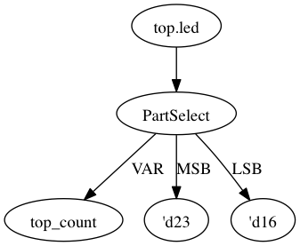
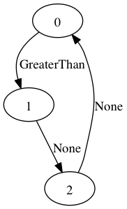

Pyverilog
==============================

[](https://github.com/PyHDI/Pyverilog/actions/workflows/main.yml)
[](https://www.travis-ci.com/PyHDI/Pyverilog)

Python-based Hardware Design Processing Toolkit for Verilog HDL

Copyright 2013, Shinya Takamaeda-Yamazaki and Contributors


License
==============================

Apache License 2.0 (http://www.apache.org/licenses/LICENSE-2.0)


Publication
==============================

If you use Pyverilog in your research, please cite the following paper.

- Shinya Takamaeda-Yamazaki: Pyverilog: A Python-based Hardware Design Processing Toolkit for Verilog HDL, 11th International Symposium on Applied Reconfigurable Computing (ARC 2015) (Poster), Lecture Notes in Computer Science, Vol.9040/2015, pp.451-460, April 2015.
[Paper](http://link.springer.com/chapter/10.1007/978-3-319-16214-0_42)

```
@inproceedings{Takamaeda:2015:ARC:Pyverilog,
title={Pyverilog: A Python-Based Hardware Design Processing Toolkit for Verilog HDL},
author={Takamaeda-Yamazaki, Shinya},
booktitle={Applied Reconfigurable Computing},
month={Apr},
year={2015},
pages={451-460},
volume={9040},
series={Lecture Notes in Computer Science},
publisher={Springer International Publishing},
doi={10.1007/978-3-319-16214-0_42},
url={http://dx.doi.org/10.1007/978-3-319-16214-0_42},
}
```


What's Pyverilog?
==============================

Pyverilog is an open-source hardware design processing toolkit for Verilog HDL. All source codes are written in Python.

Pyverilog includes **(1) code parser, (2) dataflow analyzer, (3) control-flow analyzer and (4) code generator**.
You can create your own design analyzer, code translator and code generator of Verilog HDL based on this toolkit.


Contribute to Pyverilog
==============================

Pyverilog project always welcomes questions, bug reports, feature proposals, and pull requests on [GitHub](https://github.com/PyHDI/Pyverilog).

for questions, bug reports, and feature proposals
--------------------

Please leave your comment on the [issue tracker](https://github.com/PyHDI/Pyverilog/issues) on GitHub.

for pull requests
--------------------

Please check "CONTRIBUTORS.md" for the contributors who provided pull requests.

Pyverilog uses **pytest** for the integration testing. **When you send a pull request, please include a testing example with pytest.**
To write a testing code, please refer the existing testing examples in "tests" directory.

If the pull request code passes all the tests successfully and has no obvious problem, it will be merged to the *develop* branch by the main committers.


Installation
==============================

Requirements
--------------------

- Python3: 3.7 or later
- Icarus Verilog: 10.1 or later

```
sudo apt install iverilog
```

- Jinja2: 2.10 or later
- PLY: 3.4 or later

```
pip3 install jinja2 ply
```

Optional installation for testing
--------------------

These are required for automatic testing of **tests**.
We recommend to install these testing library to verify experimental features.

- pytest: 3.8.1 or later
- pytest-pythonpath: 0.7.3 or later

```
pip3 install pytest pytest-pythonpath
```

Optional installation for visualization
--------------------

These are required for graph visualization by dataflow/graphgen.py and controlflow/controlflow_analyzer.py.

- Graphviz: 2.38.0 or later
- Pygraphviz: 1.3.1 or later

```
sudo apt install graphviz
pip3 install pygraphviz
```

Install
--------------------

Now you can install Pyverilog using setup.py script:

```
python3 setup.py install
```


Tools
==============================

This software includes various tools for Verilog HDL design.

* vparser: Code parser to generate AST (Abstract Syntax Tree) from source codes of Verilog HDL.
* dataflow: Dataflow analyzer with an optimizer to remove redundant expressions and some dataflow handling tools.
* controlflow: Control-flow analyzer with condition analyzer that identify when a signal is activated.
* ast\_code\_generator: Verilog HDL code generator from AST.


Getting Started
==============================

First, please prepare a Verilog HDL source file as below. The file name is 'test.v'.
This sample design adds the input value internally whtn the enable signal is asserted. Then is outputs its partial value to the LED.

```verilog
module top
  (
   input CLK, 
   input RST,
   input enable,
   input [31:0] value,
   output [7:0] led
  );
  reg [31:0] count;
  reg [7:0] state;
  assign led = count[23:16];
  always @(posedge CLK) begin
    if(RST) begin
      count <= 0;
      state <= 0;
    end else begin
      if(state == 0) begin
        if(enable) state <= 1;
      end else if(state == 1) begin
        state <= 2;
      end else if(state == 2) begin
        count <= count + value;
        state <= 0;
      end
    end
  end
endmodule
```

Code parser
------------------------------

Let's try syntax analysis. Please type the command as below.

```
python3 pyverilog/examples/example_parser.py test.v
```

Then you got the result as below. The result of syntax analysis is displayed.

```
Source:  (at 1)
  Description:  (at 1)
    ModuleDef: top (at 1)
      Paramlist:  (at 0)
      Portlist:  (at 2)
        Ioport:  (at 3)
          Input: CLK, False (at 3)
        Ioport:  (at 4)
          Input: RST, False (at 4)
        Ioport:  (at 5)
          Input: enable, False (at 5)
        Ioport:  (at 6)
          Input: value, False (at 6)
            Width:  (at 6)
              IntConst: 31 (at 6)
              IntConst: 0 (at 6)
        Ioport:  (at 7)
          Output: led, False (at 7)
            Width:  (at 7)
              IntConst: 7 (at 7)
              IntConst: 0 (at 7)
      Decl:  (at 9)
        Reg: count, False (at 9)
          Width:  (at 9)
            IntConst: 31 (at 9)
            IntConst: 0 (at 9)
      Decl:  (at 10)
        Reg: state, False (at 10)
          Width:  (at 10)
            IntConst: 7 (at 10)
            IntConst: 0 (at 10)
      Assign:  (at 11)
        Lvalue:  (at 11)
          Identifier: led (at 11)
        Rvalue:  (at 11)
          Partselect:  (at 11)
            Identifier: count (at 11)
            IntConst: 23 (at 11)
            IntConst: 16 (at 11)
      Always:  (at 12)
        SensList:  (at 12)
          Sens: posedge (at 12)
            Identifier: CLK (at 12)
        Block: None (at 12)
          IfStatement:  (at 13)
            Identifier: RST (at 13)
            Block: None (at 13)
              NonblockingSubstitution:  (at 14)
                Lvalue:  (at 14)
                  Identifier: count (at 14)
                Rvalue:  (at 14)
                  IntConst: 0 (at 14)
              NonblockingSubstitution:  (at 15)
                Lvalue:  (at 15)
                  Identifier: state (at 15)
                Rvalue:  (at 15)
                  IntConst: 0 (at 15)
            Block: None (at 16)
              IfStatement:  (at 17)
                Eq:  (at 17)
                  Identifier: state (at 17)
                  IntConst: 0 (at 17)
                Block: None (at 17)
                  IfStatement:  (at 18)
                    Identifier: enable (at 18)
                    NonblockingSubstitution:  (at 18)
                      Lvalue:  (at 18)
                        Identifier: state (at 18)
                      Rvalue:  (at 18)
                        IntConst: 1 (at 18)
                IfStatement:  (at 19)
                  Eq:  (at 19)
                    Identifier: state (at 19)
                    IntConst: 1 (at 19)
                  Block: None (at 19)
                    NonblockingSubstitution:  (at 20)
                      Lvalue:  (at 20)
                        Identifier: state (at 20)
                      Rvalue:  (at 20)
                        IntConst: 2 (at 20)
                  IfStatement:  (at 21)
                    Eq:  (at 21)
                      Identifier: state (at 21)
                      IntConst: 2 (at 21)
                    Block: None (at 21)
                      NonblockingSubstitution:  (at 22)
                        Lvalue:  (at 22)
                          Identifier: count (at 22)
                        Rvalue:  (at 22)
                          Plus:  (at 22)
                            Identifier: count (at 22)
                            Identifier: value (at 22)
                      NonblockingSubstitution:  (at 23)
                        Lvalue:  (at 23)
                          Identifier: state (at 23)
                        Rvalue:  (at 23)
                          IntConst: 0 (at 23)
```

Dataflow analyzer
------------------------------

Let's try dataflow analysis. Please type the command as below.

```
python3 pyverilog/examples/example_dataflow_analyzer.py -t top test.v 
```

Then you got the result as below. The result of each signal definition and each signal assignment are displayed.

```
Directive:
Instance:
(top, 'top')
Term:
(Term name:top.led type:{'Output'} msb:(IntConst 7) lsb:(IntConst 0))
(Term name:top.enable type:{'Input'} msb:(IntConst 0) lsb:(IntConst 0))
(Term name:top.CLK type:{'Input'} msb:(IntConst 0) lsb:(IntConst 0))
(Term name:top.count type:{'Reg'} msb:(IntConst 31) lsb:(IntConst 0))
(Term name:top.state type:{'Reg'} msb:(IntConst 7) lsb:(IntConst 0))
(Term name:top.RST type:{'Input'} msb:(IntConst 0) lsb:(IntConst 0))
(Term name:top.value type:{'Input'} msb:(IntConst 31) lsb:(IntConst 0))
Bind:
(Bind dest:top.count tree:(Branch Cond:(Terminal top.RST) True:(IntConst 0) False:(Branch Cond:(Operator Eq Next:(Terminal top.state),(IntConst 0)) False:(Branch Cond:(Operator Eq Next:(Terminal top.state),(IntConst 1)) False:(Branch Cond:(Operator Eq Next:(Terminal top.state),(IntConst 2)) True:(Operator Plus Next:(Terminal top.count),(Terminal top.value)))))))
(Bind dest:top.state tree:(Branch Cond:(Terminal top.RST) True:(IntConst 0) False:(Branch Cond:(Operator Eq Next:(Terminal top.state),(IntConst 0)) True:(Branch Cond:(Terminal top.enable) True:(IntConst 1)) False:(Branch Cond:(Operator Eq Next:(Terminal top.state),(IntConst 1)) True:(IntConst 2) False:(Branch Cond:(Operator Eq Next:(Terminal top.state),(IntConst 2)) True:(IntConst 0))))))
(Bind dest:top.led tree:(Partselect Var:(Terminal top.count) MSB:(IntConst 23) LSB:(IntConst 16)))
```

Let's view the result of dataflow analysis as a picture file. Now we select 'led' as the target. Please type the command as below. In this example, Graphviz and Pygraphviz are installed.

```
python3 pyverilog/examples/example_graphgen.py -t top -s top.led test.v 
```

Then you got a png file (out.png). The picture shows that the definition of 'led' is a part-selection of 'count' from 23-bit to 16-bit.



Control-flow analyzer
------------------------------

Let's try control-flow analysis. Please type the command as below. In this example, Graphviz and Pygraphviz are installed. If don't use Graphviz, please append "--nograph" option.

```
python3 pyverilog/examples/example_controlflow_analyzer.py -t top test.v 
```

Then you got the result as below. The result shows that the state machine structure and transition conditions to the next state in the state machine.

```
FSM signal: top.count, Condition list length: 4
FSM signal: top.state, Condition list length: 5
Condition: (Ulnot, Eq), Inferring transition condition
Condition: (Eq, top.enable), Inferring transition condition
Condition: (Ulnot, Ulnot, Eq), Inferring transition condition
# SIGNAL NAME: top.state
# DELAY CNT: 0
0 --(top_enable>'d0)--> 1
1 --None--> 2
2 --None--> 0
Loop
(0, 1, 2)
```

You got also a png file (top_state.png), if you did not append "--nograph". The picture shows that the graphical structure of the state machine.



Code generator
------------------------------
 
Finally, let's try code generation. Please prepare a Python script as below. The file name is 'test.py'.
A Verilog HDL code is represented by using the AST classes defined in 'vparser.ast'.

```python
from __future__ import absolute_import
from __future__ import print_function
import sys
import os
import pyverilog.vparser.ast as vast
from pyverilog.ast_code_generator.codegen import ASTCodeGenerator

def main():
    datawid = vast.Parameter( 'DATAWID', vast.Rvalue(vast.IntConst('32')) )
    params = vast.Paramlist( [datawid] )
    clk = vast.Ioport( vast.Input('CLK') )
    rst = vast.Ioport( vast.Input('RST') )
    width = vast.Width( vast.IntConst('7'), vast.IntConst('0') )
    led = vast.Ioport( vast.Output('led', width=width) )
    ports = vast.Portlist( [clk, rst, led] )

    width = vast.Width( vast.Minus(vast.Identifier('DATAWID'), vast.IntConst('1')), vast.IntConst('0') )
    count = vast.Reg('count', width=width)

    assign = vast.Assign(
        vast.Lvalue(vast.Identifier('led')), 
        vast.Rvalue(
            vast.Partselect(
                vast.Identifier('count'), # count
                vast.Minus(vast.Identifier('DATAWID'), vast.IntConst('1')), # [DATAWID-1:
                vast.Minus(vast.Identifier('DATAWID'), vast.IntConst('8'))))) # :DATAWID-8]

    sens = vast.Sens(vast.Identifier('CLK'), type='posedge')
    senslist = vast.SensList([ sens ])

    assign_count_true = vast.NonblockingSubstitution(
        vast.Lvalue(vast.Identifier('count')),
        vast.Rvalue(vast.IntConst('0')))
    if0_true = vast.Block([ assign_count_true ])

    # count + 1
    count_plus_1 = vast.Plus(vast.Identifier('count'), vast.IntConst('1'))
    assign_count_false = vast.NonblockingSubstitution(
        vast.Lvalue(vast.Identifier('count')),
        vast.Rvalue(count_plus_1))
    if0_false = vast.Block([ assign_count_false ])

    if0 = vast.IfStatement(vast.Identifier('RST'), if0_true, if0_false)
    statement = vast.Block([ if0 ])

    always = vast.Always(senslist, statement)

    items = []
    items.append(count)
    items.append(assign)
    items.append(always)

    ast = vast.ModuleDef("top", params, ports, items)
    
    codegen = ASTCodeGenerator()
    rslt = codegen.visit(ast)
    print(rslt)

if __name__ == '__main__':
    main()
```

Please type the command as below at the same directory with Pyverilog.

```
python3 test.py
```

Then Verilog HDL code generated from the AST instances is displayed.

```verilog
module top #
(
  parameter DATAWID = 32
)
(
  input CLK,
  input RST,
  output [7:0] led
);

  reg [DATAWID-1:0] count;
  assign led = count[DATAWID-1:DATAWID-8];

  always @(posedge CLK) begin
    if(RST) begin
      count <= 0;
    end else begin
      count <= count + 1;
    end
  end


endmodule
```


Related Project and Site
==============================

[Veriloggen](https://github.com/PyHDI/veriloggen)
- A Mixed-Paradigm Hardware Construction Framework

[NNgen](https://github.com/NNgen/nngen)
- A Fully-Customizable Hardware Synthesis Compiler for Deep Neural Network

[IPgen](https://github.com/PyHDI/ipgen)
- IP-core package generator for AXI4/Avalon

[PyCoRAM](https://github.com/PyHDI/PyCoRAM)
- Python-based Portable IP-core Synthesis Framework for FPGA-based Computing

[flipSyrup](https://github.com/shtaxxx/flipSyrup)
- Cycle-Accurate Hardware Simulation Framework on Abstract FPGA Platforms

[Pyverilog_toolbox](https://github.com/fukatani/Pyverilog_toolbox)
- Pyverilog_toolbox is Pyverilog-based verification/design tool, which is developed by Fukatani-san and uses Pyverilog as a fundamental library. Thanks for your contribution!

[shtaxxx.hatenablog.com](http://shtaxxx.hatenablog.com/entry/2014/01/01/045856)
- Blog entry for introduction and examples of Pyverilog (in Japansese)
